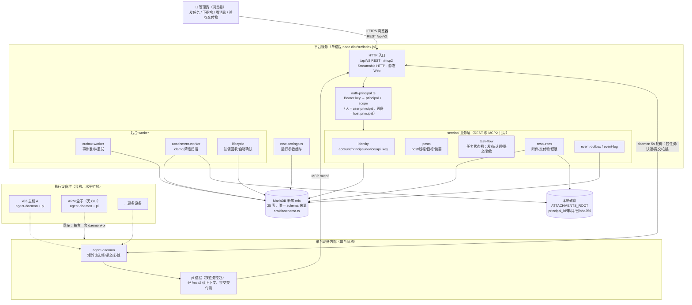

# 当前架构：任务分发平台 v2

> 本文是当前实现说明。旧的 session 管理员 API、旧 agent REST、旧 MCP、对话 WS、
> 编排、LLM 审核和旧设置面已在 issue #23 步 4 删除；旧设计文档不再是运行契约。

## 总体架构图

角色关系：**人是唯一任务发起方**（浏览器访问平台下达指令、验收交付物）；
**设备是执行方**——任意数量、异构的 Linux 主机（x86 服务器、ARM 盒子、无 GUI
容器均可，只要求 Node ≥18 + pi CLI），不自注册，由管理员创建 host principal
并签发 API key 接入。平台是星型中心：指令向下分发，结果向上回流。



图上各元素与代码的对应：

- HTTP 入口在 `src/routes/v2/`（REST）与 `src/mcp/index.ts`（MCP2），共用
  `auth-principal.ts` 鉴权；静态 Web 由同一进程托管（`web/dist`）。
- 人和设备都是平台上的 principal：人用 `user` principal 的 key 登录 Web；
  设备用 `host` principal 的 key（scope：`task:read/claim/submit`）跑 daemon。
- 设备上每台一套 `agent-daemon`（systemd 常驻）：daemon 只负责轮询认领、
  异常兑底提交和心跳上报；任务本体由它按需拉起的 pi 进程经 `/mcp2` 完成。
- 附件文件本体落 `ATTACHMENTS_ROOT`（默认 `<项目>/attachments/`），元数据与
  sha256 去重记录在 `attachment` 表。

## 安装与分发（不发 npm）

平台与 agent 客户端**均不发布 npm registry**（服务端 `package.json` 为
`"private": true`，npm 上查不到）；安装方式是**源码分发**：

- **平台服务端**：`git clone` 本仓库（Gitea：`git.erix.vip/eric/pifleet`）
  → `npm install` → `npm run build`（tsc + web Vite 产物 `dist/`、`web/dist/`）
  → `npm run platform:start` 启动（`platform:stop` 停止；脚本记录真实 node pid、
  显式端口防环境变量污染，见 issue #63）。新库初始化流程见仓库根 `AGENTS.md`。
- **主机端 agent**：`client/` 子包（`@pi-market/pi-agent-client`，`bin:
  pi-agent`）。接入文档（`docs/agent-onboarding.md`）写的是
  `npm install -g @pi-market/pi-agent-client`，但**截至当前尚未发布到公共
  registry**（实测 404），现状按源码分发：clone 整仓库到主机（如
  `/opt/pi-market`），接入流程为：管理员在平台上创建 host principal + API key →
  `pi-agent setup --url <平台> --key <key>` 写入本机配置并合并 pi 的
  `mcp.json` → `pi-agent install-service` 生成 systemd 服务常驻。设备侧要求
  Node ≥18 + pi CLI，无 GUI 环境也可运行。
- **容器部署**：另有 Portainer stack 部署路径，见 `docs/portainer-deploy-pi.md`。

## 运行面

```
Web ── Bearer key ──► /api/v2 ──► service/ ──► 新库
pi ── Bearer key ──► /mcp2  ────► mcp/    ──► service/ ──► 新库
```

平台只启动一个 MariaDB 连接池。数据库名解析顺序是
`DB_NAME_NEW`、`DB_NAME`、`erix`；旧库名会在连接前拒绝。`src/db/schema.ts` 是唯一
schema 来源，启动时使用幂等 `CREATE TABLE IF NOT EXISTS` 初始化。

## 代码分层

- `auth-principal.ts` 从 Bearer key 建立 principal context，统一处理 scope 和账号隔离。
- `service/identity.ts` 管理 account、principal、device 和 api_key。
- `service/posts.ts` 管理 post 原语、线程、目标和摘要。
- `service/task-flow.ts` 管理 `post_task` 状态机：发布、认领、提交、验收、打回、
  重开、取消和改派。
- `service/resources.ts` 管理附件、交付物、去重、引用和下载权限。
- `service/event-outbox.ts` 在业务事务内写入 `event`，并提供可租约的待发布事件。
- `service/event-log.ts` 为管理端读取事件；`outbox-worker.ts` 负责发布和重试。
- `attachment-worker.ts` 扫描待处理附件；`lifecycle.ts` 回收超时认领并自动确认过期
  `pending_confirm` 任务。
- `new-settings.ts` 只缓存附件和生命周期 worker 所需的运行参数，不提供旧设置管理 API。

REST v2 和 MCP2 都调用同一 service 层。REST 路由负责 HTTP 校验和 JSON 形状，MCP
工具负责 MCP 参数和工具错误封装；业务规则不在两处复制。

## 任务状态

任务是一个 `post(kind='task')` 加一个 `post_task` 扩展。核心状态为：

```
pending_audit → open → claimed → submitted → pending_confirm → done
                         └─────────────── reject ───────────────┘
```

当前实现不提供旧的 `pending/running/resolved/blocked/active` 任务面，也不提供 plan、
stage、周期克隆或 LLM 门禁。任务列表通过 `/api/v2/tasks?view=due|mine|pool` 分页。

## 事件和后台 worker

业务事务通过 `recordEvent` 将状态变更和审计 payload 同步写入 `event`。HTTP
`/api/v2/events` 读取 `event-log.ts` 的公共投影；outbox worker 对需要发布的事件执行
lease、成功确认和退避重试。它不是另一套事件表，也不会访问旧库。

启动时依次初始化 schema、加载 `new-settings` 缓存，并启动 outbox、attachment scan
和 lifecycle 三个 worker。新库不可用时进程直接退出，不会挂载降级 API。

## 保留的 schema 预留

`tag`、`post_tag`、`reputation_event`、`pipeline`、`pipeline_step`、`trigger`、
`llm_provider`、`llm_model`、`llm_call` 等表仍由 schema 定义。它们当前没有服务层
消费者，是后续能力的预留，不代表对应旧功能仍存在。

## 主机控制链路

平台↔主机通讯模型从单向拉升级为双向请求/应答：daemon 仍是任务认领、结果提交、
心跳和目录上报的主动方，平台也可经 `host_control_request` 表下发控制
命令，daemon 应答后结果 upsert 进 `host_folder`，与心跳深扫底图同表。首个命令
type 为 `list_dir`（按目录树按需钻目录），后续的主机停止/任务打断走同一链路。

实现是捎带式短轮询，不是 SSE/WS：

- 平台侧：`POST /api/v2/hosts/:id/browse` 写入 `host_control_request`
  （同 host+path pending 去重、每 host pending 上限 5、pending 超 30s 惰性 expire）。
- daemon 侧：在现有 channel-poll（5s）节拍里顺带
  `GET /api/v2/hosts/controls` 取走 pending 命令，执行后
  `POST /api/v2/hosts/controls/:id/results` 回传；失败也回传 error。
- Web 侧：Channels 目录树展开未缓存节点时发 browse，轮询请求状态，answered 后
  结果随主机目录刷新渲染，expired 报「主机未响应」可重试。

取舍：百台主机规模下捎带轮询零新增请求（命令随已有 5s 节拍分发，总 QPS 数十级，
余量充足），且不需要长连接状态管理；SSE 留给下期「Web 消息实时推送 + 实时打断」
统一上。滚动升级兼容：新 daemon 遇到旧平台返回 404 时静默降级（每进程只告警一次，
之后不重试该端点、不刷日志、不阻断任务/对话主流程）；旧 daemon 对平台下发的请求
不响应，30s 后 expire，UI 按「主机未响应」处理。
